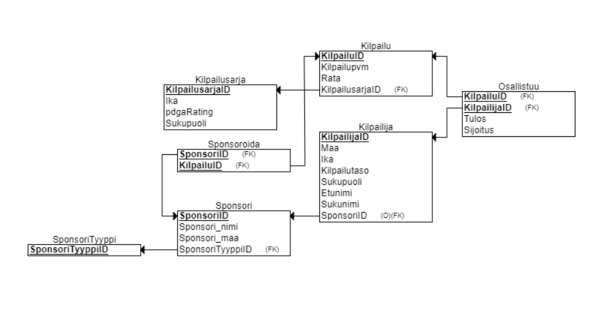

## <ins>Johdanto</ins>

Yksinkertainen ja pienehkö tietokanta -projekti frisbeegolf kisoista. Kuvitteelliset pelaajat, oikeat sponsorit ja pelipaikat. Tietokannan ohjelmistot, joita käytin projektissa, olivat [HeidiSQL](https://www.heidisql.com/) ja [MariaDB](https://mariadb.org/).

#### <ins>ER- ja relaatiokaavio</ins>

- - -

- - -

#### <ins>SQL -skripti</ins>

Alapuolella on sekä kyselyt tietokannan toimivuutta varten, että skripti tietokannan luontia varten. 

* [Tietokanta](Misc/Tietokanta.sql)
* [Kyselyt](Misc/Kyselyt.sql)
